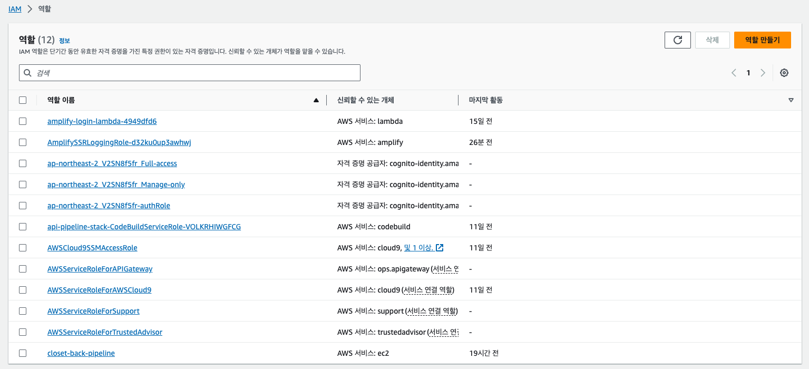
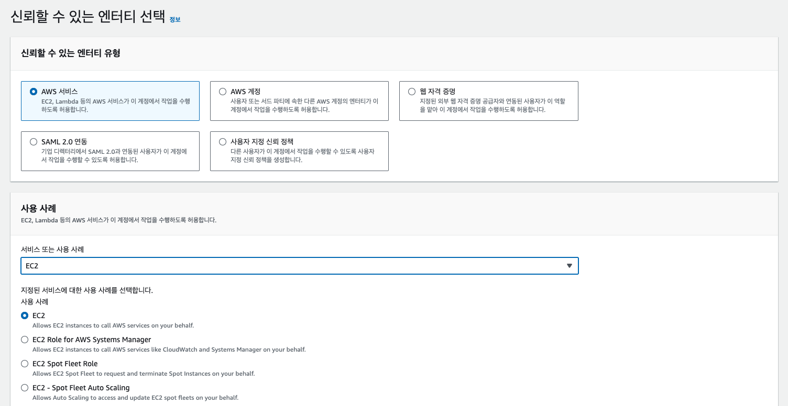
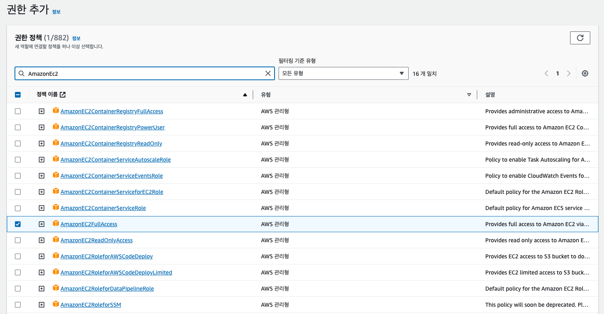
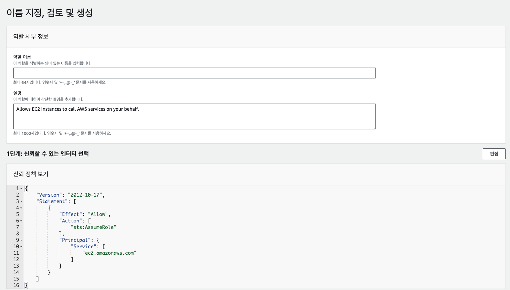
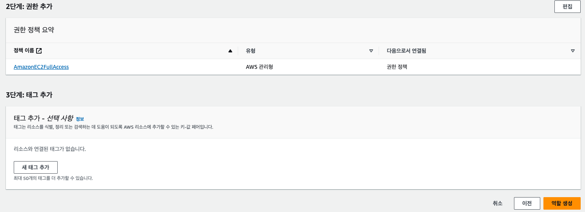
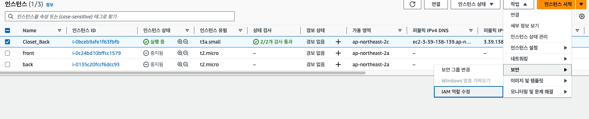
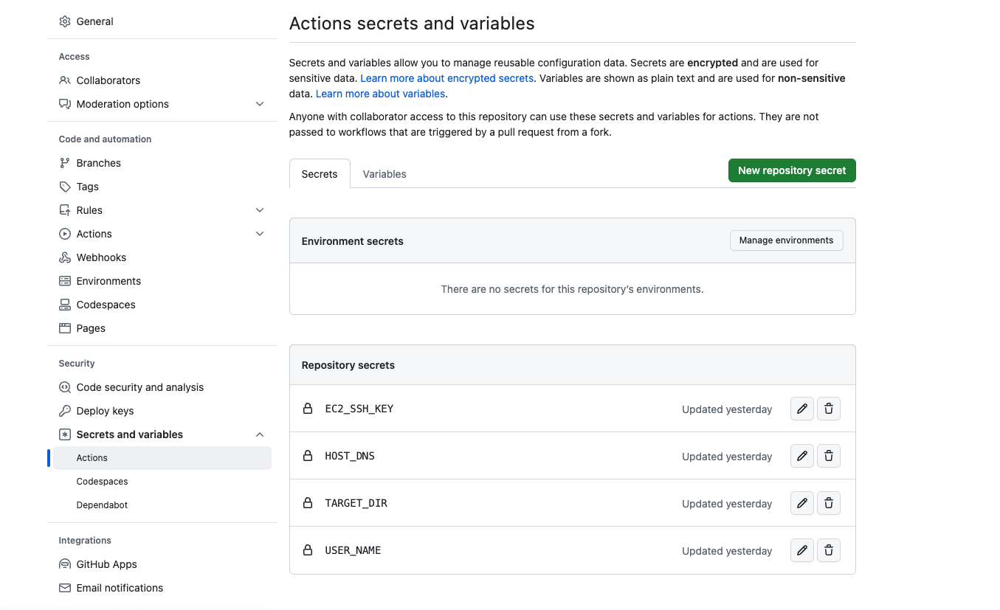
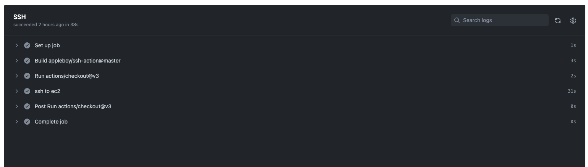

## 기존 세팅이 완료된 EC2 에 자동 배포(CD) 설정하기

현 설정은 github action 을 기준으로 한다. 또한 기본적으로 AWS 내 자동화 배포를 설정할 경우 IAM, CodeDeploy 를 활용하는 편이고, 아니라면 github runner 를 통해서 자체 호스팅을 하는 방법이 있다.<br />

다만 (내가 아직 방법을 잘 모르는 거겠지만..) 위와 같은 설정이 편리할 때는 초기 인프라 설정 단계 시점이고 내가 진행하고 있는 프로젝트의 경우 이미 많이 진행되어있는 프로젝트였고, 자동화 과정에서 원하는 정도는 간단하게 pm2 kill 이후 git pull 을 통해 Repository 를 업데이트 한 다음 다시 pm2 reload 를 하는 것이었다. 그렇기에 더 간단하게 설정할 수 있는 방법에 대해서 찾게 되었고, 그 방법은 아래와 같다.

### IAM 설정하기

우선 IAM 을 설정해주어야 하는데, 역할을 설정해준 다음 인스턴스와 연결해주어야 github 에서 현 인스턴스에 접근 권한을 가지게 된다. 우선 IAM 에서 역할에 들어가면 <br />



<br />

오른쪽 상단에 역할 생성을 클릭하자
<br />



<br />

EC2 를 선택하고 다음으로 넘어가자 (추후에 CodeDeploy 를 활용할 거라면 여기서 CodeDeploy 로 선택하면 된다.)
<br />



<br />

우리가 줄 권한은 EC2 에 대한 접근 권한이다. 따라서 이에 해당하는 권한을 검색한 뒤에 추가하여 다음으로 넘어가자. 만일 S3 에 대한 권한도 허락할 것이라면 역시나 S3 에 관한 권한을 검색하여 추가해주면 된다. 현재는 그렇지 않기에 EC2 에 대한 권한만 넘겨주도록 하자
<br />



<br />

이름과 설명을 작성한 뒤
<br />



<br />

최종적으로 설정된 권한 리스트를 확인하고 맞다면 역할을 생성하도록 하자
<br />



<br />

이제 인스턴스로 돌아와 보안 -> IAM 설정 에 들어가서 아까 생성하였던 역할을 설정해주자. 이렇게 하면 이제 github 등 외부에서 현 인스턴스에 접근이 가능해진다.

### github 환경변수 설정하기

EC2 에 접근할 권한이 생겼지만, 인스턴스에 ssh 접근을 하기 위해서는 key.pem 등 필요한 정보들이 있다. 이러한 정보를 그대로 CD.yml 파일에 기입한다면 변수가 필요없을 수 있지만, yml 파일은 레포지토리에 그대로 노출이 되기 때문에 이를 위해 github 레포지토리 내 setting 에서 환경 변수를 설정할 수 있다. github action 과정에서 자동으로 이러한 환경변수를 읽을 수 있기에 보안은 유지하면서 인스턴스 내 ssh 접근을 할 수 있게 된다. <br />

<br />



<br />

프로젝트 레포지토리에 접근해서 settings 에 들어가 Secret and variables 에 들어가자. 여기서 새롭게 secret 을 생성할 수 있다. 현재는 3가지의 환경변수가 필요한데 각각 입력되어야 할 값은 다음과 같다. <br />

- EC2_SSH_KEY: 인스턴스 설정 시 부여받은 key.pem 파일 내부 코드
- HOST_DNS: AWS 인스턴스 탭에서 해당 인스턴스를 클릭할 시 아래 정보에 나오는 퍼블릭 IPv4 DNS (그대로 복사해서 넣어놓도록 하자)
- USER_NAME: 보통 ubuntu 로 생성하였다면 그대로 이름이 ubuntu 이다.
  <br />

**참고로 위 환경변수가 햇갈린다면 인스턴스 연결 시 나오는 ssh 부분을 참고해보자. 이 명령어에 들어가는 인스턴스 정보들이 환경 변수에 들어가는 것이다.**

<br />

이제 환경변수를 다 생성하였다면 이제 거의 준비가 끝났다.

### workflow 작성하기

프로젝트 root 경로에 .github/workflows/파일이름.yml 을 생성하자. 여기서 설정한 흐름대로 자동적으로 이벤트가 트리거 시 실행이 될 것이다. <br />

```yml
name: CD

on:
  push:
    branches: [main] # main branch 로 push 됬을 때 실행된다.

jobs: # 수행할 작업이다.
  SSH: # 수행할 작업의 이름이다.
    # 우분투로 실행할 것이며, 만일 github runner 를 이용할 시 Self-hosted 로 변경해주면 된다.
    # 참고로 self-hosted runner 란 사용자가 지정하는 로컬 컴퓨팅 자원으로 빌드를 수행하도록 설정하는 기능이다.
    # 주로 배포작업이 많아 배포가 지체되거나 서비 비용이 부담되는 경우 유용한 기능이다.
    # 사용 서버비용이 없기 때문에 배포작업이 많을 경우 유용하다고 할 수 있다.
    runs-on: ubuntu-latest

    steps: # 단계를 나타낸다.
      - uses: actions/checkout@v3 # 이 부분은 일종의 template 라고 생각하면 된다.

      # 어떤 작업을 할지 이름을 작성할 수 있다.
      - name: ssh to ec2
        uses: appleboy/ssh-action@master # 이부분에서 애를 먹었던 기억이 있는데, 그냥 이 template 를 활용하도록 하자
        with:
          key: ${{ secrets.EC2_SSH_KEY  }} # 앞서서 설정해둔 환경변수가 여기에서 사용된다.
          host: ${{ secrets.HOST_DNS  }}
          username: ${{ secrets.USER_NAME  }}
          script: |
            sudo chown -R $USER:$USER . 
            sudo su
            cd Closet/back
            npx pm2 kill
            git config --global --add safe.directory /home/ubuntu/Closet
            git pull
            npm install
            npm start
```

<br />

실제 push 를 해보니 권한문제 때문에 `sudo chown -R $USER:$USER .` 을 설정해주긴 했었다. 다음 root 권한으로 이동 한 뒤 서버 루트로 이동하고 실행중인 pm2 를 중단 한 다음, git pull 을 통해서 변경 사항을 업데이트 한다. 이후 다시 서버를 실행시키는 과정이다.
<br />



<br />

배포에 성공할 시 위와 같은 화면을 확인할 수 있다.

### 정리

정말 단순한 자동화 workflow 를 적용시키기 위해 수도 없이 배포에 실패했었다. 이러한 과정을 통해 왜 개발자분들이 인프라 설정은 초기에 해놓는것이 좋다고 했는지 이해가 가는 부분이었다. 또한 배포의 경우 역시 서버 비용이기에 이를 고려하여 VM 과 serverless 를 결정해야 할 것 같았다.
