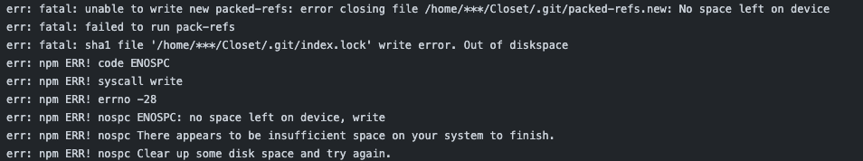
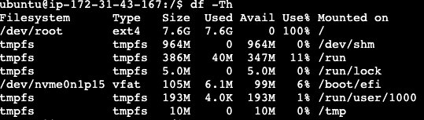
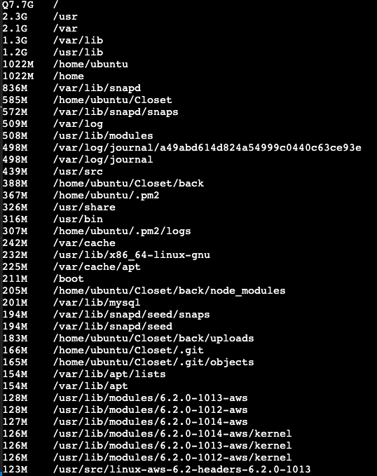
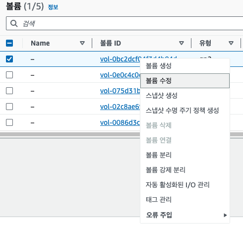
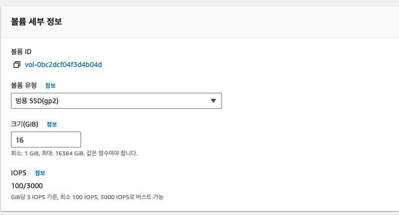
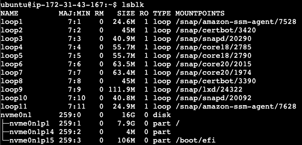
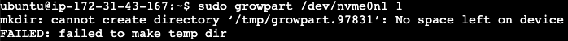
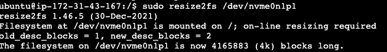
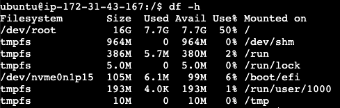

## EBS 볼륨 확장

평소처럼 git push 를 통해 ec2 내 자동 배포를 진행중이었는데, 어느 순간부터 업데이트가 되지 않고 있었고 그 원인을 찾아보니, 용량이 꽉 차서 npm update 를 할 수 없다는 메시지가 log 에 작성되었다. <br />



<br />

오류 메시지에서 말하고 있듯이(No space left on device) 현재 가동중인 ec2 인스턴스의 허용 용량이 초과되었다는 의미이다. 아마 기존 설정 그대로이니 8gb 의 용량일텐데 실제 사용 용량을 확인해보니 거진 100% 를 다 사용하고 있었다. <br />



<br />

```
df -h
```

<br />

위 /dev/root 의 용량을 보아하니 100% use 의 위엄을 보여준다!.. 이를 해결해야 할 듯 싶다. 실제 파일이 차지하는 용량에 대해서 알아보기 위해 쭉 나열을 해보면,

<br />

```
sudo du -x -h / | sort -h | tail -40 | sort -h -r
```

<br />



<br />

아직까지는 엄청나게 용량을 차지하는 부분을 잘 찾지 못하겠다. 다만 앞으로 관리가 필요해보이는 부분은 .pm2의 log 부분과 upload 폴더, 그리고 .git 내 파일정도가 있을 듯 싶다. 이 부분은 좀 더 고민을 해봐야 겠다는 생각이 든다. <br />

여하튼 뭔가 크리티컬 한 부분은 나오지 않아, 일단은 기존 8기가의 용량을 16기가로 증대 시켜주기로 결정하였다. 방법은 다음 순서를 통해서 진행하면 된다. <br />

#### 인스턴스 설정창

우선 AWS 내 실행중이자 용량 증대를 하고싶은 인스턴스를 타고 들어가 하단 스토리지 부분의 사용중인 불륨을 클릭하여 불륨 메뉴로 들어간다. <br />



<br />

그런 다음 수정창이 뜨게 되면 용량을 8기가에서 16기가로 변경해주자 (더 많이 할 수록 요금은 더 비싸진다...). 용량 증대 과정은 몇 분 소요될 수 있다. <br />



<br />

여기서 설정을 하였다고 바로 반영이 된다면 좋겠지만 안타깝게도 실제 인스턴스 연결을 통해서 추가 설정을 해주어야 한다.

### 인스턴스 root 접근

다시 인스턴스 콘솔창으로 돌아오자. 먼저 어떠한 디스크를 증대시켜야 할지 알아야 하기에 lsblk 명령어를 입력하도록 하자. <br />



<br />

명령어를 입력하면 실제 증대시켜야 할 disk 를 알 수 있다. 우리는 아까전에 16기가로 증대를 하였고, 이 부분이 nvme0n1 에서 실제 증대가 되어있음을 확인할 수 있다. 다만 루트 볼륨이 증대가 되어있다고 한들 그 밑 실제 사용중인 파티션 (7 기가 부분) 이 증대가 되질 않았다. 이를 늘려주도록 하자. <br />

```
sudo growpart <볼륨> <파티션번호>

sudo growpart /dev/nvme0n1 1

```

<br />

참고로 불륨 하단 파티션에서 p1, p14.. 이렇게 되어있는것은 번호를 나타내며, 명령어 창에서 파티션번호를 입력할때는 숫자만 입력한다. <br />

파티션 용량을 증대시킬때 주의할 점이 있는데, <br />

- 파티션의 타입이 ext4 가 아닌지
- 현 root 볼륨의 잔여 용량이 너무나도 없을 시

<br />

위 2가지 경우에 따라 처리해주어야 할 과정에 차이가 존재한다. 우선 첫번째의 경우 생성한 인스턴스의 버전에 따라 centos7 이후 AWS 에서는 아래와 같은 명령어로 실행하여야 한다. <br />

```
sudo xfs_growfs /dev/nvme0n1

```

<br />

또한 현 root 불룜에 여유가 너무 없다면 아래와 같은 에러가 발생하는데, <br />



<br />

파티션 용량을 증대하려면 /tmp/growpart 파일이 생성되어야 하는데, 이 파일을 저장할 용량조차 없다는 것이니깐, 이를 해결하려면 일부 파일을 삭제에 여유 용량을 만들어주거나 다음과 같은 명령어를 기입해서 해결할 수 있다. <br />

```
sudo mount -o size=10M,rw,nodev,nosuid -t tmpfs tmpfs /tmp

```

<br />

위 명령어를 입력하고 다시 `sudo growpart /dev/nvme0n1 1` 입력 시 CHANGED 라는 메시지가 띄어지면서 성공적으로 파티션 증대가 된다. <br />

파티션까지 증대하였다면 이제 우리가 사용하는 파일 시스템에다가 변경된 파티션 용량을 적용시켜야 한다. <br />

```
sudo resize2fs <파티션>
```

<br />

주의할 점은 파티션을 정확히 기입해야 한다는 점이다. 즉, `/dev/mvme0n1p1` 이라고 입력해야지 성공적으로 파일 시스템에 적용이 된다. <br />



<br />

이제 정말로 증가되었는지 확인해보자. 명령어 `df -h` 입력 시 <br />



<br />

위 스크린샷 처럼 `/dev/root` 내 사이즈가 16기가가 되어있고, 현재 사용가능한 용량이 50% 로 증가되었음을 확인할 수 있다.

### 요금?

스토리지 증대에 있어 30기가 까지는 free tier 요금제가 적용이 되어 무료로 사용가능하다. 확실히 버전이 업데이트되고 사용자 수가 증가한다면 이러한 용량 관련 문제도 좀 더 체계적으로 다루고 준비해야한다 생각이 들었다. 또한 이를 통해 서버리스 서비스를 사용하여 자동 스케일업을 활용하는 방안도 좋은 방안이 될 수 있다 생각이 들었다.
