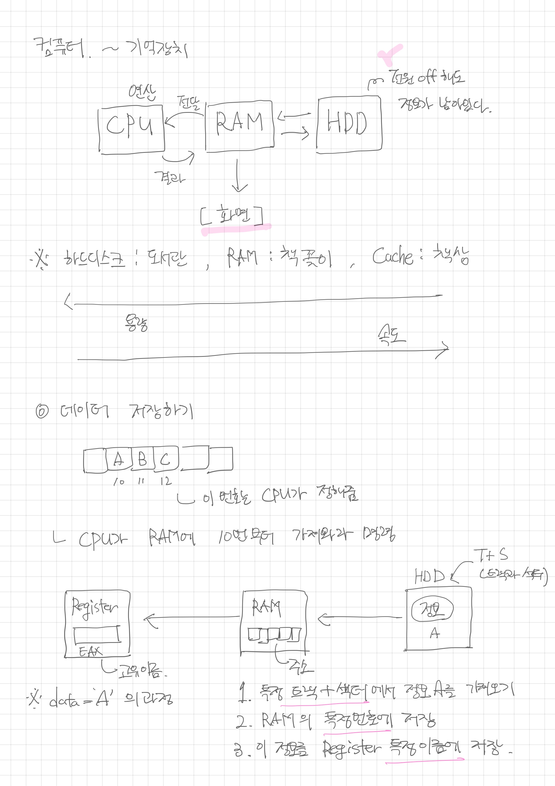
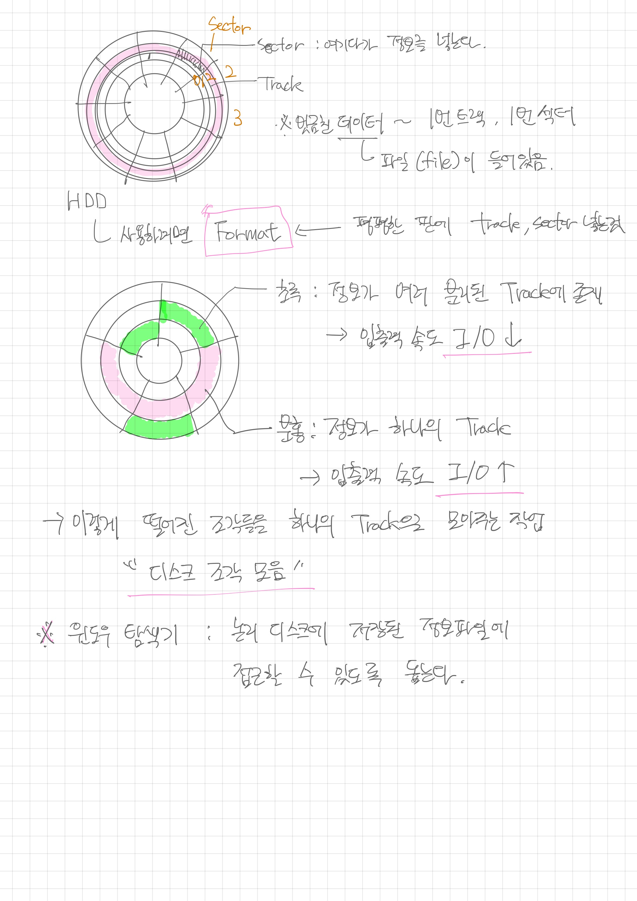
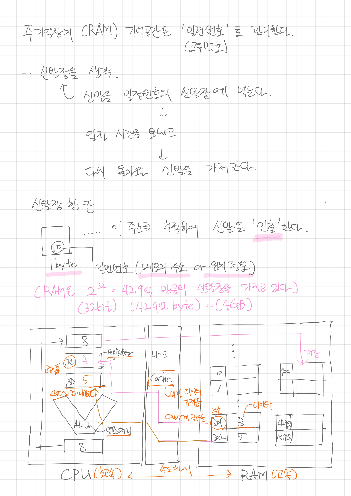
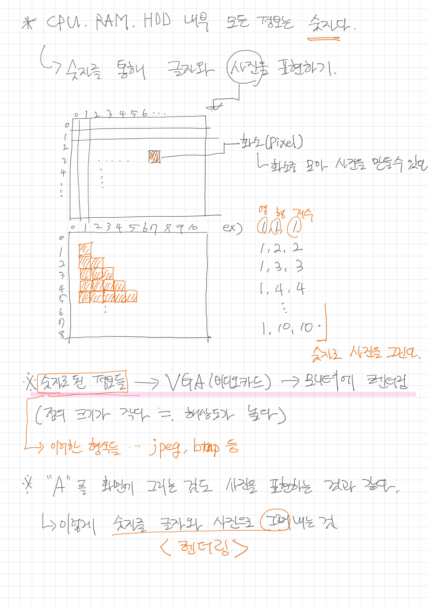

<h2 align="center"> Computer </h1>
<h3 align="center"> 매일 공부한 부분을 간략하게 정리하자 </h3> 
 

<h2 id="프로젝트소개"> :book: 작성일 기록 </h2>

- [2023.2.6](#2023-2-6)
- [2023.2.8](#2023-2-8)
- [2023.2.12](#2023-2-12)

   

<h2 id="프로젝트소개"> :book: 간단한 요약 정리 </h2>

## 2023-2-6

### 컴퓨터 관련 기본 용어 정리

컴퓨터는 크게 2가지로 소프트웨어와 하드웨어로 이루어져 있다. 소프트웨어들은 윈도우, 맥 등등 프로그램이며 이 역시 2가지로 나뉜다. 응용 프로그램과 시스템 프로그램으로 나뉘게 된다. 

### 한번 설치해보기

컴퓨터 메인보드마다 CPU 를 끼울 수 있는 소켓의 규격이 각각 다르다. CPU 를 장착하는건 쉬우나, 열이 엄청나게 난다. 이를 위해서 CPU 위에다가 쿨러를 장착한다.
 

메인보드에 역시나 램을 꽃을 수 있는 부분이 존재한다. `램`은 용량이 있고, 클수록 성능이 좋다. 램은 CPU의 연산을 돕는 주기억장치이다. 전원이 끄면 내용이 사라진다. 램까지 설치했다면, 파워까지 연결하고 그 다음 기본적으로 컴퓨터를 실행할 수 있다. 물론 실제 실행을 하려면 하드디스크가 필요하다. `하드디스크`는 요새는 ssd 를 주로 사용하고, 이렇게 파워와 연결을 하고, 나머지 연결은 실제 데이터가 전송되는 통로인 `sata` 가 있다. 하드디스크는 일시적인 기억을 장기기억으로 전환할 때 필요한 장치이다. 전원을 꺼도 내용이 사라지지 않는다.
ssd 는 nand flash 를 사용하며, 속도가 훨씬 빠르다.
 

컴퓨터에 연결되는 모든 장치들을 `주변기기` 라 하며 컴퓨터와 주변기기가 연결되는 지점(단자)이 `인터페이스` 이다.
 

- 메인보드
  - 가장 기본적으로 CPU와 RAM 을 칩셋을 통해 연결해준다. 그 외 주변기기들을 연결해준다.
  - 메인보드는 인터페이스를 가지고 있다. 예를 들어 SATA, USB(사운드), VGA(비디오)...
- CPU
  - 컴퓨터의 연산을 담당한다.
- RAM
  - 주기억장치로서 CPU 에게 연산과제를 전달하고 받는다. 컴퓨터를 끄면 기억이 사라진다
- HDD,SSD
  - 외부 장기기억장치로서 RAM 에서 기억을 전달받아 계속 기억한다.
  - 메인보드의 인터페이스인 SATA 와 연결이 된다.
- 모니터
  - 숫자로 이루어진 데이터를 받아 데이터시각화를 해주는 장치

### 1비트에서 진법변환까지

컴퓨터를 이해한다는 것은 CPU 구조를 이해하는것이 중요하다. 우선 1비트라는 말을 알아야 하고, 진법변화를 할 줄 알아야 한다.

> **1비트**

- 1비트란 전기 스위치 1개를 의미한다.
- 전기가 흐르는 On 상태는 1이다.
- 전기가 흐르지 않는 Off 상태는 0이다.
- 예를 들어 4비트는 0110 처럼 스위치가 4개인 것이다.
- 여러 비트를 조합을 하면서 큰 수를 표현할 수 있는데, 0110 = 6 (10진수) 라고 할 수 있다.
- 이처럼 비트를 병렬처리 하면서 2진수로 해석하면 큰 수를 해석할 수 있다.
- 4비트는 2^4 가지의 경우의 수를 가지게 된다.
- 이 비트는 용량이 아니라 표현의 최소 수준이다.

> **GB(기가바이트)**

- 8개 비트를 하나로 묶어 1 바이트(byte)라 한다. 이는 기억 공간의 최소단위이다.
- 1 바이트는 영문자 한 글자가 저장될 수 있는 메모리 크기다. (한글 한 글자를 저장하려면 2 바이트가 필요하다)
- 2의 10제곱은 1024이다
- 2의 32제곱은 약 42.9억이다. 약 42.9억 바이트는 곧 4GB(기가바이트) 이다.
- 2의 32제곱은 32bit 를 의미한다. 즉, 32비트 구조의 한계 용량은 4GB 이다.
- 4비트는 16가지, 8비트는 256가지, 16비트는 65,536가지 (64kb) 이다. (암기)

## 2023-2-8

- 4비트는 16진수로 볼 때 한자루 숫자에 해당한다.
- 16진수는 0~f 까지 16개로 이루어져있다.
- 즉, 10이 A 가 된다.
- 16진수 한자리 숫자는 4비트 이니, 두개의 숫자라면 8비트 이며 용량은 1바이트가 된다.
- 0000 과 1111 사이 모든 가짓수를 16진수 한자리수로 표현이 가능하다.

메모리 주소를 보다보면 앞에 ox 라고 표현되어있느것을 볼 수 있는데, 이것이 16진수라고 생각하면 된다. 쉽게 예시를 들어보자. ox ff 라는 16진수가 있다면, 이는 곧 1111 1111 인 2진수로 표현이 가능하다. 또한 15 * 16 + 15 * 1 을 통해 10진수로 표현이 가능하다. 이렇게 4비트씩 쪼개서 표현할 수 있는 것이 16진수이다. 

### CPU 가 작동하는 원리

우선 디지털 회로라는것을 먼저 살펴보아야 한다. 여기서 논리식이 나오게 되는데(AND,OR,XOR,NOT) 이를 이용해서 반도체를 만들 수 있다. 
 

| input1 | input2 | AND | OR  | XOR | NOT |
| ------ | ------ | --- | --- | --- | --- |
| 1      | 1      | 1   | 1   | 0   | 0   |
| 1      | 0      | 0   | 1   | 1   | 1   |
| 0      | 1      | 0   | 1   | 1   | 1   |
| 0      | 0      | 0   | 0   | 0   | 1   |

논리식이 왜 반도체에서 사용이 되냐면, 앞에서 살펴보았듯이 1이 전류가 들어온 상태이고, 0 이 전류가 들어오지 않은 상태라 가정할 때, 두 개의 전선에 따라 input 값이 2개라고 하면 이 input 값을 논리식을 통해서 output 을 결정할 수 있기 때문이다.
 

만약 한군데서 전력이 들어오고 한군데에서는 들어오지 않는다고 하였을 때, 논리식이 AND 가 적용된다면 나가는 곳에는 전력이 나가지 않게 될 것이다.
 

이 논리식의 핵심은 CPU 가 어떻게 연산을 하는지에 대한 대답이기 때문이다. 컴퓨터는 이 논리식을 이용하여 연산을 처리하게 되는데, 이러한 방법을 통해 컴퓨터는 덧셈을 하게 된다. 왜 덧셈이 중요하냐하면 덧셈을 할 수 있다는것은 곧 모든 사칙연산을 처리할 수 있다는 의미이기 때문이다.
 

CPU 에서는 아까 예시로 둔 2개의 전선을 논리회로라고 하며, 여기에 적용되는 논리식 처리를 가산기에서 처리한다고 한다. 가산기는 반가산기와 전가산기로 나뉘게 되는데, 반가산기는 1비트 덧셈 연산을 처리하며, 전가산기 연산은 2진수기준 자리이동까지 담당할 수 있게 된다.
 

- 1+1 가 2라는 사실을 우린 알고있다.
- 이를 2진수로 표현하면 10 이된다.
- 2진수로 1을 표현하면 01 이다.
- 즉 01 + 01 이 되는것인데, 맨 마지막자리수 1+1 을 하면 2가 되고 2진수에서는 자리이동이 이루어져야 한다. 따라서 1의 자리는 0이 된다.
- 자리이동이 일어나 두번째 자리수 0+0 에 1이 추가된다. 따라서 10 이 최종적으로 만들어진다.
   

반가산기는 1비트 계산을 처리한다. 즉 앞에서 1의 자리수 덧셈 처리와 같다고 생각하면 된다.
자리이동을 반가산기는 담당하지 않는다. 자리이동까지 구현하는 가산기를 전가산기라 한다. 전 가산기는 1비트 계산 반가산기를 병렬구조로 옆으로 연결시키며(자리이동) 덧셈을 진행한다. 그래서 만약 반가산기를 32개 연결시키면 32비트이며 32비트 CPU 가 되는것이다.

- 또 다른 예시를 들어보자
- 3+2 를 하면 5가 나온다는 사실을 알고 있다. 이를 4비트 단위로 계산을 처리해보자
- 3은 0011, 2는 0010 이고, 이 둘을 더한다면 1의 자리수부터 덧셈이 이어진다.
- 1+0 은 1이고, 1+1은 2이기에 자리이동을 처리해 결과적으로 0이다.
- 최종적으로 0101 이 생성이 된다. 이와같이 덧셈처리가 가능하다.
   

그렇다면 뺄셈은 어떤식으로 처리하는가? 뺄셈 역시 덧셈으로 표현이 가능한데, 이는 보수를 활용하면 가능하다. 예를 들어 6의 보수는 4이다. 즉 6에서 얼마를 더해야 10이 나오는지를 파악해보면 4라는 것을 알 수 있고 이 숫자가 6의 보수이다. 그렇다면 12-3=9 라는 과정을 보수를 이용해서 풀어보면 어떻게 될까. 뺄셈 3의 보수는 7이다. 이 7을 12중 같은 단위수인 2와 더하면 9가 나온다. 그 옆 1은 버려주자. 그렇게되면 최종적으로 9가 나오게된다
 

컴퓨터는 이를 활용하여 뺄셈을 진행한다. 앞서 예제를 둔 3과 2를 통해 뺄셈을 이어나가보자

- 3-2=1 이라는 것을 알 수 있다.
- 2의 보수를 2진수로 표현해야하는데 이미 2를 넘어버렸다.
- 이럴 떄 2의 보수는 1의 보수 + 1 로 구현할 수가 있다.
- 1의 보수는 간단한것이 0 -> 1, 1 -> 0 으로 변환을 해주면 된다.
- 3은 0011 이었고, 2는 0010 이었다. 2의 보수는 1101 이다.
- 여기에 +1 을 하게되면(0001) 1+1=0 이 되면서 자리이동이 일어나고, 최종적으로 1110 이 된다.
- 이제 0011 과 1110 을 더해보자.
- 앞선 계산법으로 계산하면 10001 이 됨을 알 수 있고, 이는 5비트이기에 4비트에서 넘어선거니, 넘어선 부분을 제외해버리면(앞에서 12에서 1 뺀것처럼), 최종적으로 0001 이 남게 된다.
- 0001 은 1이다.
   

이를통해 알 수 있는 내용은 컴퓨터는 덧셈으로서 다 표현한다는 것이고, 실제로 곱셈과 나눗셈 역시 덧셈으로 표현할 수 있다. 곱셈이라는 것은 결국 그 횟수만큼 더해주면 되는것이다. 나눗셈 역시 그 횟수만큼 빼주면 되는것이다. 빼기는 보수의 덧셈으로 구현이 가능하니 결국은 <strong>사칙연산 모두를 덧셈으로 표현이 가능한 것이다.</strong>
 

물론 나눗셈의 경우 조심해야한다. 즉 0으로 나눠줄 경우, 0을 계속 빼봤자 계속 값은 그대로이고, 이는 컴퓨터가 제한없이 계속해서 덧셈을 진행한다는 의미이다. 실제로 이런 처리를 해준 반도체의 경우 저항이 있기에 열이 발생하고, 따라서 반도체가 터쳐버리는 영상도 있다. 이런 부분은 예외 처리를 해주어야 하고, 자바스크립트에서는 0으로 나누면 infinity 로 표현하는데, 결국 자바스크립트의 엔진 역시 cpu 기반이기 때문이다.
 

참고로 곱셈을 하는 방법에는 비트를 왼쪽으로 shift 하는 방법과, 나눗셈을 할때는 오른쪽으로 shift 하는 방법이 있다.

- 2진수이니 곱셈과 나눗셈 모두 2라고 가정을 하자
- 3*2 = 6 이다. 이를 2진수로 표현하면 0011 * 2 라고 할 수 있겠다.
- 왼쪽으로 비트를 한칸씩 옮겨주자. 00110 이 된다. 당연히 맨 왼쪽 0은 지워주자
- 그럼 0110 이 남게되고 이는 6이다.
- 반대로 6을 2로 나눠주자. 0110 을 오른쪽으로 이동시키면 00110 이 되고, 오른쪽끝자리를 지워주자
- 그럼 0011 이 되어 3이된다.
   

다시 정리하자면, 컴퓨터의 연산과정은 모두 덧셈이라는 것을 이해하고, 이 덧셈은 논리식으로 처리된다는 점을 기억하자.

## 2023-2-12

### 기억장치

보통 기억장치로서 다뤄지는 것을 보게 되면, 피라미드 구조로 그려지게 된다. register <-> backup database 로 용량과 연산속도에 따라 구별이 된다.

컴퓨터는 기본적으로 모든 것이 다 숫자다. 정보가 저장된 위치가 있을 것이고 이 위치 역시 숫자로 표현하게 된다. 레지스터, 주 기억장치, 보조 기억장치를 관리하는 방법은 조금씩 다르다

- 레지스터는 개별 기억공간마다 고유 이름을 붙인다.
- 주 기억장치는 일련번호를 붙인다.
- 보조기억장치는 트랙번호와 섹터번호를 붙여 관리한다.

- 위 그림처럼 HDD 부터 나아가 RAM 을 거쳐서 CPU 의 레지스터에 정보가 저장이 된다.

### HDD 의 트랙과 섹션, 그리고 포맷의 원리

format 이라는것은 한번쯤 들어봤을 텐데, HDD 를 format 한다는 것이 어떠한 의미인지 , 그리고 어느 부분이 track 이고 section 인지 아래 그림을 참조하자

- 디스크조각 모음을 하는 것은 결국 입출력속도를 기존보다 빠르게 하기 위함이다.
- 정보가 분할되어있다면, 그만큼 미디어의 회전하는 수가 증가하게 된다.

### 주 기억장치는 정보를 일련번호로 관리한다

- RAM 은 고속인데 비해 CPU 의 연산속도는 초고속이기에 속도차이가 발생한다
- 이에 CPU에서 앞으로 할 연산작업에 필요한 정보를 CPU 가 요청하기 전에 먼저 cache 에 저장한다
- 이후 CPU 는 이 정보를 요청한다
- 이러한 정보들은 레지스터에 각각 저장이 되고, 레지스터는 고유한 이름을 지니고 있다
- 이후 CPU 는 연산을 시작하여 그 결과값 역시 레지스터 내에 임시 저장을 한다
- 그 다음 RAM 의 특정 고유 번호를 지닌 공간에다가 보낸다

이러한 일련의 단계들을 각각의 코드라 표현하고 기계가 한다고 해서 기계어 코드라고 표현한다.

### 컴퓨터가 글자를 다루는 방법

- 특정 숫자를 특정 글자로 사상하는 방식이며 이를 '코드체계'라 한다. 대표적으로 ASCII 코드
- 기존 컴퓨터마다 대문자 A 를 나타내는 숫자가 모두 달라 혼란이 생기고, 그로 인해 미국에서 아스키코드를 규정한 것이다
- 사진이나 그림 역시 숫자로 표현할 수 있다.

- 디지털 사진이나 그림파일은 저마다의 숫자의 규칙을 가지고 있고, 이 규칙에 따라 VGA 는 화면에 그려준다
- 이렇게 글자나 그림을 그려주는 것을 랜더링이라 한다.
