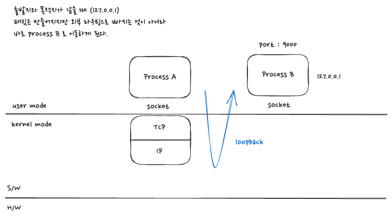

## IP 주소의 종류

- Global IP : 총 32bit 로 이루어진 IP, 인터넷상에서 같은 IP 는 존재하지 않는다.
- Private IP : 작은 소규모 인터넷을 구축. 공유기에서 많이 사용된다. (참고로 공유기는 하나의 global IP 를 여러 host 가 사용할 수 있도록 처리)
- Loopback : 127.0.0.1, 자기 자신을 나타낸다.
   

 
