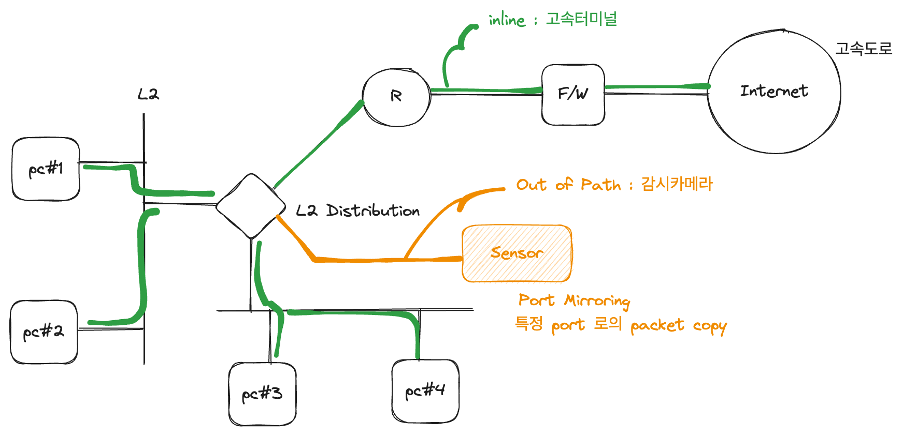

## Inline 과 Out of Path

- inline 과 out of path 모두 packet 단위이다.
- inline 이 고속도로로 진입하기 전 IC 및 터미널이라고 한다면 out of path 는 과속방지카메라와 같다.
- 보통 out of path 는 스위치와 라우터 간 전송되는(inline) packet들을 특정 port 내 copy 한다. 이를 port mirroring 이라고 한다.
- 이렇게 copy 를 하는것은 cpu 를 더 과도하게 사용할 수 있다. 그럼에도 이렇게 하는 이유는 말 그대로 '감시' 해야하기 때문이다
- Sensor 로서 관리, 해킹감독 등등 여러 정보를 얻기 위해서 packet 을 copy 한다.
