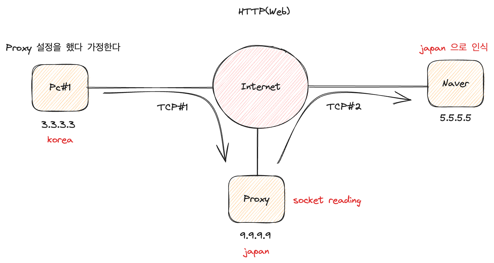

## Proxy

- 앞서 배운 inline 과 out of path 모두 packet 이 데이터단위라면, proxy 는 user application proxy 라 표현하며 socket 에 의한 stream 데이터 단위를 다루게 된다.
- 첫번째 활용 방안은 우회이다.
- 단 주의할 점은, proxy pc 에서는 전송받는 stream 데이터를 읽는것이 가능하기에 정보가 유출될 수 있다.
   

 

- 두번째 활용 방안은 분석이다.
- 패킷이 인터넷을 통해 전송이 될 때는 SSL 로 인해 암호화가 되어있고, 이를 분석하기가 어렵다
- 프락시를 거치게 되면, 프락시에서 암호화를 진행하기 때문에 이 전까지는 암호화가 되어있지 않다. 따라서 분석이 가능
- 세번째 활용 방안은 감시와 보호이다.
- 만약 어떠한 웹사이트에 접속했을 때, 자동적으로 바이러스를 전송하는 상황을 생각해보자.
- 만약 프록시를 거쳐서 웹사이트로 접속하게 되면, 이 바이러스가 바로 클라이언트로 전달되는것이 아니라 프록시로 전달되기 때문에 보호의 역할도 가능하다
- 반대로 감시도 가능한데, 프록시에 연결된 컴퓨터가 3대 있다고 가정해보자. 이 중 한대의 컴퓨터가 유튜브에 접근하였다면 이 기록을 프록시로 감시할 수 있다. 두번째 기능인 분석을 떠올려보면 이해가 된다.
