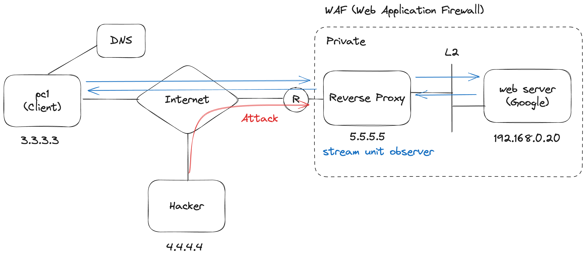

## Reverse Proxy

 

- 웹 서버에도 앞단에 프록시서버가 있을 수 있다
- reverse 라 하는 이유는 보통 proxy 의 방향과는 반대이기 때문이다
- 클라이언트에서 인터넷간의 연결이 public 이라면 proxy 부터 web server 는 private 이다.
- 만약 해커가 web server 에 접근하려고 한다면, reverse proxy 에서 방어한다
- 그렇기에 WAF (Web Application Firewall) (또는 방화벽) 이라고 한다
- 어플리케이션 단계이니 L7 의 Stream 단위의 데이터를 분석한다.
