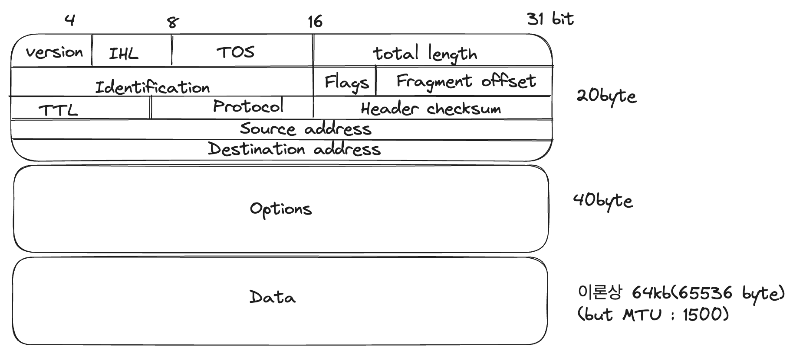
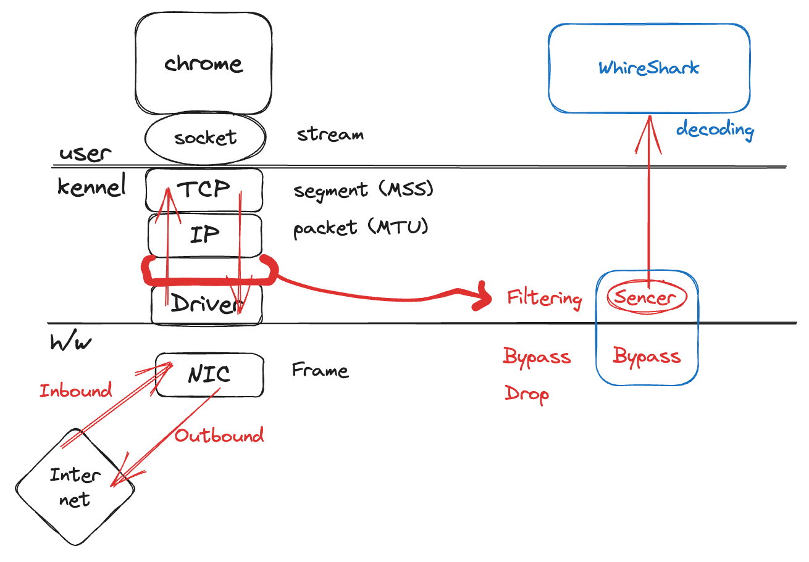
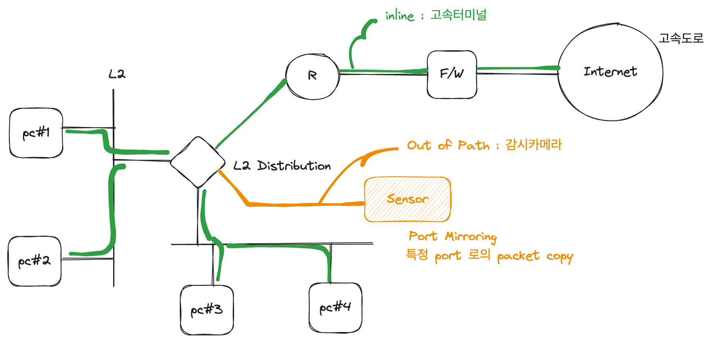

## 실제 학습내용을 정리하기 전 최소한 암기를 해야하는 부분에 대해서 정리하기

암기가 필요하긴 하기에, 우선적으로 주제에 대한 암기해야할 부분을 정리하고자 한다.

### MAC, IP, Port 번호가 식별하는 대상하는 대상은 무엇일까?

- Mac : NIC(LAN 카드)들은 MAC 주소를 가지고 있다. 유선, 무선을 지원한다면 그 컴퓨터는 MAC 주소가 2가지라고 해도 된다.
  - MAC 주소는 하드웨어 주소지만 변경이 가능하다.
- IP : NIC 하나에 여러 IP 주소가 binding 된다. 컴퓨터 한대에 IP 주소가 여러개일 수 있다. ()
- Port: OSI 계층에 따라 user mode(프로세스 식별자), kernel mode(서비스 식별자), h/w mode(인터페이스 식별자) 로서 다양하게 해석된다.

### OSI 7 계층에 너무 집중하지 말자

- MAC, IP, Port 모두 식별자다.

### Host, switch

- 컴퓨터중에 네트워크와 연결되어있다면 이를 호스트(Host) 라고 부른다.
- 이러한 호스트 중에서 네트워크를 이용하는 호스트와 네트워크 자체를 이루는 호스트가 있는데, 이때 네트워크 자체를 이루는 컴퓨터라면 스위치(switch) 라고 한다.
- 네트워크를 이용하는 호스트를 엔드포인트(endpoint) 라고도 한다. (peer, server, client)
- 스위치에는 라우터(router)가 있고, 인터넷은 라우터 + DNS 의 집합체라고 이해하자.
- 라우터의 경우 계층중에 무엇으로 스위치 하는지에 따라 이름이 달라진다. 예를 들어 IP 로 스위치한다하면 L3 스위치, TCP 로 스위치한다하면 L4 스위치
- L3 스위치 = 라우터

### IP주소

- IP 주소는 호스트에 대한 식별주소
- IPv4 : 32bit 주소체제 - 2^32 -> 43억개정도
- IPv6 : 128bit 주소체제
- IP 주소는 8bit (0~255) 씩 끊어서 표시한다. (8 \* 4 = 32bit)
- IP 주소는 네트워크 ID 하고 호스트 ID 로 나뉜다.
- 이 주소체계에서 네트워크 ID 의 길이를 나타내주는것이 서브넷마스크
- 예를 들어 192.180.123.14 와 서브넷마스크 255.255.255.0 이라면 각각의 자리마다 bit 연산 AND 를 하게되면 192.180.123.0 이 되고 이 주소가 네트워크 ID 이다.

### Port

- Port 는 소켓에 바인딩 된다
- Port 는 2^16 개만큼 존재한다. (0~65535)
- port 는 프로세서 식별자이다. 패킷이 전달될 때 운영체제 수준에서 포트 번호에 따라 경로가 결정된다

### Switching

- 앞에서 언급한 스위치는 라우터라고 생각하자.
- 네트워크를 고속도로라 가정하고 패킷을 자동차라고 하자. 목적지로 가야하는데 교차로가 있다. 이 교차로가 바로 스위치이며 라우터이다.
- 라우터는 여러 라우터와 연결되어있고, 어떤 방향은 목적지로 못가고 어떤 방향은 돌아가야한다.
- 라우터에서 다른 라우터로 가기로 결정하는것을 switching 이라고 한다.
- 목적지까지 가려면 이정표(고속도로 안내판)가 필요한데 이를 라우팅 테이블이라고 한다.

### 데이터 단위

- user 모드 application process 수준(socket 수준)에서는 Stream 단위. (끝을 알수없는 데이터)
- Stream 데이터를 네트워크로 보낼 때는 분해가 일어난다. 잘려진 조각 하나를 Segment 라고 한다
- 이 잘려진 조각을 인터넷 환경에서 전송 가능하게 포장한 것을 패킷(packet)이라고 한다
- 이 패킷의 최대 크기는 1500byte 밖에 안한다
- 패킷을 실어 나를때는 frame 데이터에 넣는다. (인캡슐)

### 인터페이스 선택 (유선 인터넷 vs 무선 인터넷들)

- 스위칭은 달리 말하면 인터페이스 선택이라고 할 수 있다.
- 그렇다면 만약 인터넷에 무선과 유선으로 연결되어있다고 하면 컴퓨터는 어떤 기준으로 이 둘중 하나를 선택할까?
- 이 때 고려되는 사항이 바로 매트릭이다. 매트릭은 쉽게 말해 연결되어 전송되는데 들어가는 비용이라고 생각하면 된다
- 즉 매트릭 값이 적은 라우터가 선택된다.

### LAN 과 WAN

- 인터넷은 가상 네트워크이다. 물리적이지 않다. 인터넷은 WAN 으로 본다.
- LAN 은 1,2계층(하드웨어) 이라고 생각. 물리적이다.

### 패킷의 생성 원리

- 패킷은 헤더와 페이로드로 나뉜다.
- 헤더는 또 2가지로 나뉜다. IP(20byte) 와 TCP(20byte)
- stream 이 socket 을 타고 tcp 로 내려갈 때 segment 로 다 나누어진다.
- 패킷을 도감청 할 때 쓰는 용어: DPI
- segment 는 packet 의 내용물이라 생각하자.
- 즉, segment 가 payload 가 되는셈이다.
- segment 는 L4, packet 은 L3, frame 은 L2

### L2 스위치

- MAC 주소가 속한 L2. 따라서 MAC 주소로 스위칭 하는것이다.
- Mac 주소는 거진 유일하다고 생각하면 된다. (48bit)
- L2 Access 스위치는 pc 와 가장 인접한 스위치(End point[컴퓨터]와 가장 인접한)
- L2 Distribution 스위치는 스위치를 위한 스위치라고 생각할 수 있으며, 다른 pc 나 라우터와 연결될 수 있다. 그래서 요건 Access 와 연결되는 것이다.
- Uplink : L2 Access -> L2 Distribution (상위 계층 스위치로 연결되는 것)
  - Link - up : 렌 케이블과 연결됨 (초록불) ... 햇갈리지말자

### IP Header

 

- IHL(IP Header Length) : 헤더의 길이로 보통 5 (그래야 5 \* 4byte = 20byte)
- 32bit = 4byte
- Identification : 단편화에 대한 정보. 보통 MTU 는 1500 인데, 간혹 패킷 최대용량이 1400 인 곳이 있고 이러한 부분에 대해서 패킷전송의 순서를 정할 때 사용
- TTL(Time To Live) : 패킷의 생존 횟수. 패킷은 라우터를 따라 이동하는데, 하나의 라우터를 이동할 때마다 TTL 이 1씩 감소한다. TTL 은 0~255 까지의 갯수이므로 총 256 번 라우터를 이동할 수 있다.
- 그 외 출발지 IP, 도착지 IP 가 나타나있다.

### wireshark의 작동 구조와 원리

 

- 패킷을 분석할 때 와이어샤크를 활용한다.
- OSI 계층에서 패킷이 L2 를 넘어 전송이 되기 전, 의도적으로 패킷에 대한 filter 를 추가할 수 있다.
- 이 filter 는 패킷을 그대로 전송시키는 Bypass, 걸러버리는 Drop 을 결정하게 된다.
- 반면 filter 와 달리 Sencer 역시 추가할 수 있는데, 센서는 Bypass 만 가능하고, 센서의 주된 목적은 패킷의 감청에 있다.
- 이렇게 감청된 패킷을 디코딩 하여 분석하는 것이 whireshark
- 참고로 프레임이 외부 네트워크로 전달이 될 때를 Outbound 라고 하고 들어오는것을 Inbound 라고 한다.
- 자신의 패킷 전송값을 감청하는것은 괜찮으나 그 외 사용은 법 위반이다.

### Router의 내부 구조

- 방화벽과 라우터는 모두 L3 스위치에 속하고, 이는 IP 로 통신을 한다
- 내부적으로 라우터는 Bypass 인지 Drop 인지 결정하고 어디로 패킷을 보내줄 지 결정한다. 이러한 처리 과정을 inline 처리라고 한다
- 패킷을 전송할 때, NIC 수준에서 바로 전송하느냐, IP수준에서 처리하느냐, 사용자 프로세서 수준에서 처리한 이후 전송하느냐에 따라 라우터의 처리속도가 달라진다.

### Inline 과 Out of Path

- inline 과 out of path 모두 packet 단위이다.
- inline 이 고속도로로 진입하기 전 IC 및 터미널이라고 한다면 out of path 는 과속방지카메라와 같다.
- 보통 out of path 는 스위치와 라우터 간 전송되는(inline) packet들을 특정 port 내 copy 한다. 이를 port mirroring 이라고 한다.
- 이렇게 copy 를 하는것은 cpu 를 더 과도하게 사용할 수 있다. 그럼에도 이렇게 하는 이유는 말 그대로 '감시' 해야하기 때문이다
- Sensor 로서 관리, 해킹감독 등등 여러 정보를 얻기 위해서 packet 을 copy 한다.

### Proxy
