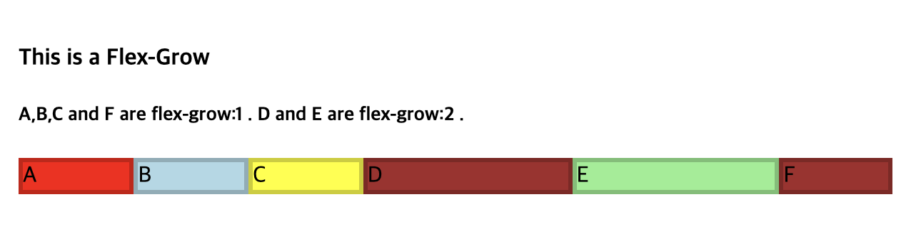

## Flexbox

<p>flex 를 다루는데 있어서 중요한 부분은 메인축(mainaxis) 를 잘 파악하는 것!</p><br />
<p>메인축을 다루는 프로퍼티는 justify-content, 수직축을 다루는 프로퍼티는 align-items, align-content 가 있다.</p>

## Flex-wrap

<p align="justify">
flex 에서 wrap 과 nowrap 의 상황에 따라서 align-items, align-content 의 사용에도 영향을 끼치게 된다. 만약 wrap 으로 설정이 되어있어서, 화면이 축소함에 따라 요소가 축소되지 않고 밑으로 넘어갈 경우, align-items 로 설정했다면 생각처럼 화면 구성이 안나올 수 있다. <br>
줄 바꿈 현상이 일어나게 되면 메인축이 줄마다 생성이 되기 때문에, align-items 의 경우 각 메인축에 대한 수직축에 대해서 적용하기 때문에, center 로 설정해도 모든 요소가 viewpoint 중간으로 오는것이 아니라, 각각의 차지하는 공간의 중간으로 이동하게 된다. <br>
만일 전체가 다 가운데로 이동하게 하고 싶다면 align-content 를 사용하면 된다. 사실 사용하다보면 이를 다 따지기는 힘들기에 우선 align-items 를 사용해보고 아니다 싶으면 align-content 를 사용하자.
</p>

## flex-grow

<p>한 요소에 width 값을 지정해주지 않았을 때, flex 를 통해 내부 요소를 배치하게 되면, 일정 컨텐츠 크기 만큼만 가로 배치가 된다. 이때 flex-grow : 0 초과 숫자 를 기입할 시, 내부 최대 컨텐츠 가로폭을 능가하면서 배치가 이루어지게 된다는 점을 참고하자.</p>
<br />

```html
<h4>This is a Flex-Grow</h4>
<h5>A,B,C and F are flex-grow:1 . D and E are flex-grow:2 .</h5>
<div id="content">
  <div class="small" style="background-color:red;">A</div>
  <div class="small" style="background-color:lightblue;">B</div>
  <div class="small" style="background-color:yellow;">C</div>
  <div class="double" style="background-color:brown;">D</div>
  <div class="double" style="background-color:lightgreen;">E</div>
  <div class="small" style="background-color:brown;">F</div>
</div>
```

<br />

```css
#content {
  display: flex;

  justify-content: space-around;
  flex-flow: row wrap;
  align-items: stretch;
}

.small {
  flex-grow: 1;
  border: 3px solid rgba(0, 0, 0, 0.2);
}

.double {
  flex-grow: 2;
  border: 3px solid rgba(0, 0, 0, 0.2);
}
```

<br />


