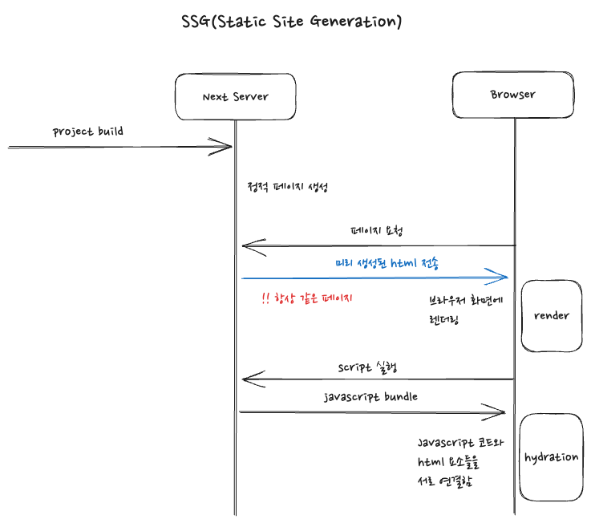

## Next.js 의 SSG

서버에 페이지를 요청할 때마다 페이지를 새롭게 생성하여 반환하는 서버사이드렌더링과는 다르게, 빌드 시 미리 정적 페이지를 생성하여 페이지를 요청할 때 바로 전달하는 렌더링 전략을 SSG(Static Site Generate) 라고 한다.  

  

 

사실 이러한 방식은 예전 서버 사이드 렌더링 방식과 가깝다고 할 수 있다. 서버는 매 페이지에 대한 html 파일을 가지고 있으며, 페이지 요청 시 바로 html 파일을 전달한다. (혹은 CDN 에서 캐시로 가지고 있다가 전달한다)  

장점이라면 SSR 대비 매우 빠른 server response 를 보여준다. 빌드 타임때 미리 렌더되어있던 html 이기에 그냥 바로 전송해주면 된다.  

단점이라면 미리 생성한 페이지이기에, 페이지가 사용하는 데이터가 변화하여도 이를 반영할 수가 없다. 이러한 단점이 있기에 SSG 의 경우 데이터의 변화가 거진 발생되지 않을 부분에 한하여 사용하는것이 좋다.  

next.js 로 프로젝트를 구현하다보면 느끼게 되지만, 되도록이면 정적 페이지로서 빌드 타임시 생성해놓는것이 좋다. 다만, 페이지별로 그것이 불가능한 경우도 존재하기에, 설계를 잘 해야할 것이다.
