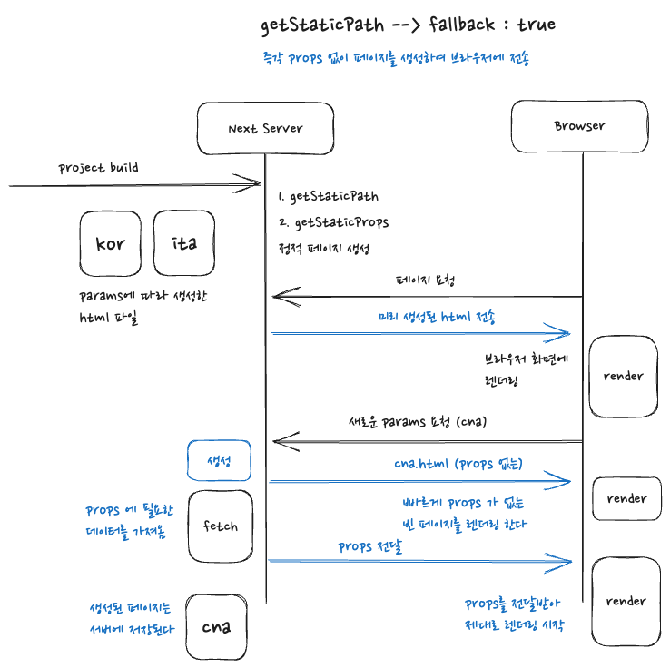

## Next.js 의 SSG

서버에 페이지를 요청할 때마다 페이지를 새롭게 생성하여 반환하는 서버사이드렌더링과는 다르게, 빌드 시 미리 정적 페이지를 생성하여 페이지를 요청할 때 바로 전달하는 렌더링 전략을 SSG(Static Site Generate) 라고 한다. <br />

<p align="center">
  
</p>

<br />

사실 이러한 방식은 예전 서버 사이드 렌더링 방식과 가깝다고 할 수 있다. 서버는 매 페이지에 대한 html 파일을 가지고 있으며, 페이지 요청 시 바로 html 파일을 전달한다. (혹은 CDN 에서 캐시로 가지고 있다가 전달한다) <br />

장점이라면 SSR 대비 매우 빠른 server response 를 보여준다. 빌드 타임때 미리 렌더되어있던 html 이기에 그냥 바로 전송해주면 된다. <br />

단점이라면 미리 생성한 페이지이기에, 페이지가 사용하는 데이터가 변화하여도 이를 반영할 수가 없다. 이러한 단점이 있기에 SSG 의 경우 데이터의 변화가 거진 발생되지 않을 부분에 한하여 사용하는것이 좋다. <br />

next.js 로 프로젝트를 구현하다보면 느끼게 되지만, 되도록이면 정적 페이지로서 빌드 타임시 생성해놓는것이 좋다. 다만, 페이지별로 그것이 불가능한 경우도 존재하기에, 설계를 잘 해야할 것이다.

## 동적 경로에 대한 SSG 설정

빌드 시 정적 페이지를 생성하는 방식의 단점은, 이미 생성해놓은 페이지가 없다면 반환할 수 없다는 부분에 있다. <br />

효율이 좋더라도 페이지 반환을 못한다면 의미가 없다고 할 수 있겠다. 다행이도 next.js 는 이에 대해 getStaticPath 함수를 사용하여 해결할 방법을 제시한다. <br />

```jsx
export const getStaticPath = async () => {
  //.. params 에 대하여 처리해주는 로직

  return {
    paths: [
      { params: { code: "CNT" } }, // 여기서 code 는 [code].js 이기에 code 인것이다.
      { params: { code: "KOR" } }, // 값은 데이터를 받아와서 전부 넣어줄 수 있다.
    ],
    fallback: false,
  };
};

export const getStaticProps = async () => {
  // 넣어줄 props 처리

  return {
    props: {
      code,
    },
  };
};
```

<br />

원리를 살펴보자면 정적 페이지로 생성될 가능성이 있는 모든 페이지를 미리 생성한다고 생각하면 된다. 즉, /url/1 부터 /url/10 까지의 페이지가 미리 생성되어야 한다면, 1~10 까지의 paths 를 넘겨주어 getStaticProps 로 넘어가게 된다. 이를 바탕으로 총 10개의 정적 페이지를 빌드 시 생성하게 된다. <br />

이러한 방식으로 블로그의 글 처럼 여러 페이지를 미리 빌드해야 할 경우에 대응할 수 있게 된다. <br />

중요한 점은 fallback 설정인데, 이에 대해서 좀 더 살펴보도록 하자.

## fallback

상황은 여러가지가 있다. SSR 과 같이 요청 마다 페이지를 생성하는것이 아니기에, 다르게 말하자면 자원이 한정적이라는 것이고 유저는 이를 미리 알고 행동할 이유가 없다.

### fallback : false

false 로 설정했을경우, 유저가 미리 생성하지 않았던 페이지를 요청할 시 404 페이지를 전달하게 된다. <br />

<p align="center">
  
</p>

<br />

즉각적인 페이지 응답을 제공하지만, 404 페이지라는 점에서 좋은 경험은 아닐 것이다.

### fallback : blocking

blocking 으로 설정 할 시, 마치 SSR 처럼 요청받은 페이지를 생성하여 브라우저에 전달하고, 생성해둔 페이지는 server 에 저장해놓는다. 이후 같은 요청이 올 경우 기존 정적 페이지를 전달하는 과정을 그대로 진행하게 된다. <br />

<p align="center">
  
</p>

<br />

설사 생성해놓지 않은 페이지라 해도 즉각 요청에 따라 생성하여 브라우저에 전달하기에, false 보다 훨씬 대응적이라고 할 수 있다. 다만 단점이라면 요청시 생성이라는 점에서 SSR이 가지고 있는 단점인 loading 시간을 경험시켜야 한다는 부분이다.

### fallback : true

true 로 설정하면, 신기하게도 만일 없는 페이지를 요청할 시 먼저 props 가 전달되지 않은 페이지를 브라우저에 전달한다. 그래서 사용자는 일단 완성된 페이지는 아니어도 즉각적으로 loading 대신 페이지를 볼 수 있게 된다. <br />

이후 server 에서 props 를 브라우저에 전달한다. 브라우저는 props data 를 받아 다시 화면을 렌더링하게 되어 과정은 마무리된다. <br />

<p align="center">
  
</p>

<br />

blocking 의 문제점인 loading 화면을 어느정도 해소할 수 있는 방안인데, 이러한 방식은 페이지의 성격에 따라 적용 여부를 결정하는게 좋아보인다. 만일 props 에 지나치게 의존하는 페이지라면 그냥 blocking 방식이 더 적합할 수 있다고 생각이 든다. 반면 props 에 큰 영향을 받지 않는 페이지라면 true 로 설정해주면 사용자의 경험을 좀 더 향상시킬 수 있을 것이다.
