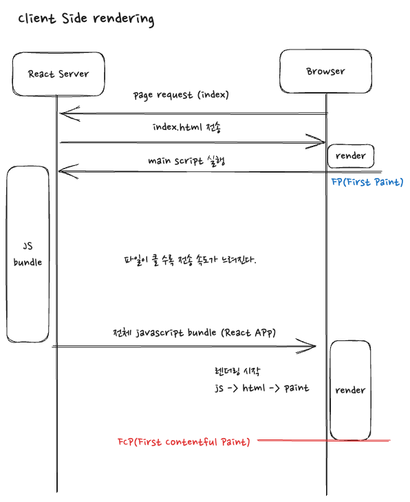
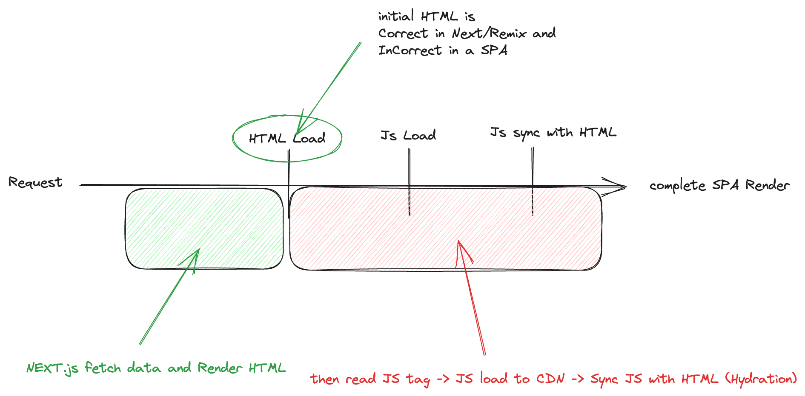

## Next.js 의 SSR

비단 next.js 뿐 아니라 다른 프레임워크 역시 서버사이드 렌더링을 진행하면 이와 같은 방식이라고 생각한다.  

기존 React 기반 프로젝트가 지향하는 CSR 방식에는 약간의 단점들이 존재하는데, 기업의 입장에서는 검색 엔진 최적화가 중요할 수 있지만, 사실 이 부분은 어느정도 다른 방향의 해결책이 있다고 할 수 있다. 거기다가 크롬의 경우 직접 검색 엔진이 js 를 실행시켜 이후 데이터베이스에 저장한다고 하니 점점 더 싱글페이지 어플리케이션들이 가진 문제점들도 어느정도 해소되어 간다고 할 수 있겠다.  

이와 달리 초반 페이지의 브라우저 렌더링 까지의 시간 단축부분은 SSR의 장점이라고 할 수 있다(물론 검색 엔진 부분도 여전히 강점이다). 기존 React 방식은 모든 렌더링 처리를 하나의 페이지내에서 자바스크립트 파일을 실행시켜서 상황에 맞게 렌더링을 진행하게 된다.  

 

위 그림을 보면 알 수 있듯이, 처음으로 브라우저 내 페이지가 제대로 paint 되는데 까지의 시간(FCP)이 bundle js 의 파일의 크기와 server 의 상태에 따라 길어질 수 있다. 사용자는 결국 계속해서 빈 페이지를 보고 기다리고 있어야 하기에 조금이라도 늦어지면 이탈해버리는 사용자의 특성상 생각이상으로 큰 문제라고 할 수 있겠다.  

AWS의 cloudFront 와 같은 CDN 을 통해 파일을 캐시하여 server response 를 줄이는 방안 역시 유효할 수 있지만, 좀 더 효과적인 방법을 사용해보자.  

 

한창 CSR 이 대세가 되기 전, 주로 사용하던 방식인 SSR 을 React의 장점인 CSR 과 결합하여 좀 더 효율적으로 렌더할 수 있도록 next.js가 도와준다. 위 그림처럼 실제 유저가 확인할 수 있는 의미있는 페이지를 먼저 렌더링하고(FCP), 이후 이 html 내 script 를 해석하여 server 에게 js 파일을 요청한다.  

server 는 전체 js 파일이 아니라 페이지에 필요한 만큼의 js 파일을 전달해준다. 이 js 파일은 기존 react app 과 동일하다고 생각해도 된다. 즉, 전달받은 js 파일 역시 html 로 렌더링이 가능하고, 이렇게 렌더링한 결과와 현 브라우저 내 렌더링이 되어있는 DOM 과의 비교, 결합 과정이 이루어진다.  

마치 마른땅에 물을 준다고 하여 hydration(수화) 라고 표현한다. (이 과정때문에 프로젝트를 진행하다보면 hydration error 를 접하게 될 수 있다. 즉, 처음 서버에서 전달된 html 의 DOM 과 이후 js로 렌더링한 Html 간의 DOM 이 일치하지 않을 경우 hydration 을 진행할 수 없기 때문이다.)  

hydration 과정까지 마무리된다면 이제 유저는 정상적으로 인터렉션이 가능해진다.  

 

이후 현 페이지 내 모든 이벤트는 CSR 방식으로 작용한다. (navigation 역시 CSR 방식). 즉 React App 과 동일하다고 생각하면 된다.
