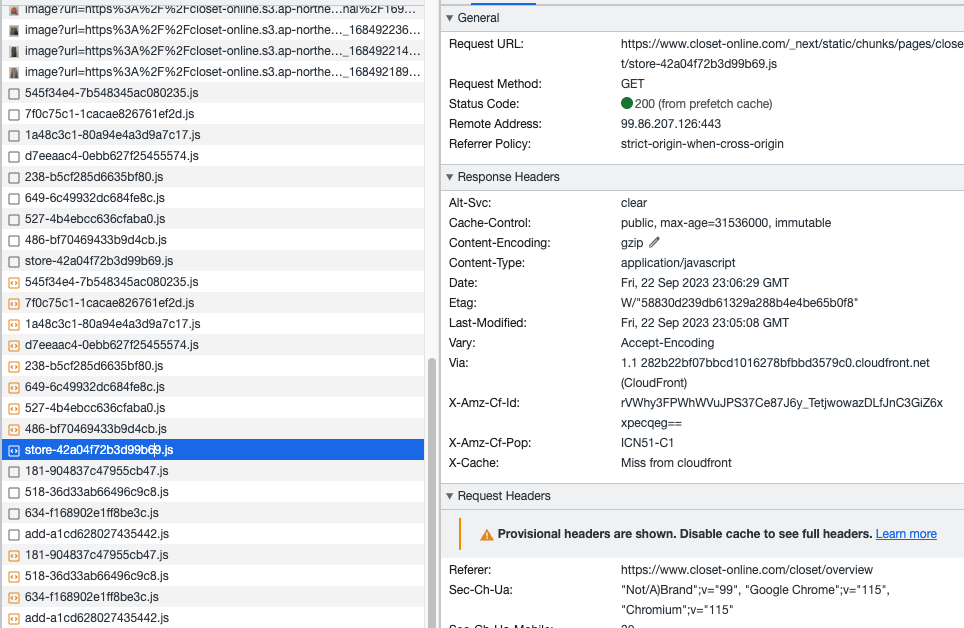
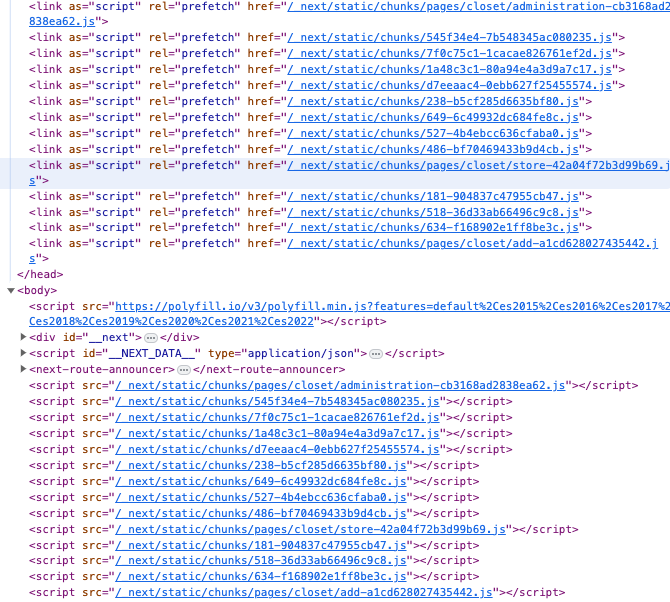

## 페이지가 전환되는 시간동안 Loading 페이지 띄우기

React 내에서 URL 의 변경으로 인한 페이지 이동은 사실 페이지가 이동하는것이 아닌, Route 내 지정된 path 에 따른 element 를 렌더링 하는 것이다. 즉, 이러한 element 에 해당하는 js 를 실행시켜 실제 DOM 생성을 통해 마치 페이지가 이동된 것처럼 보일 뿐이다.<br />

처음 모든 js 를 가져와야 한다는 점에서 유의미한 화면이 렌더링 되기 까지는 시간이 걸리지만 이후부터는 페이지 이동에 있어서 정말 부드러운 반응을 보여주게 된다. 페이지는 하나지만 그 페이지를 마치 지우고 다시쓰고를 반복하게 되기에 Single Page Application 라고한다.<br />

이러한 점에서 Next.js 는 분명 React 기반 프레임워크이지만 SPA 를 지향하고 있는것은 아니라는 것을 우리는 알고 있다. 정적 페이지를 빌드 시 생성하여 매치되는 path 에 맞는 html 을 렌더링 하거나, 해당 path 로의 요청이 발생할 때 자체 서버에서 (필요하다면 data fetch 까지 더해서) 페이지를 생성하여 브라우저에 전달하는 과정인 SSR 을 기반으로 SPA 와는 다른 렌더 과정을 지니고 있다. 물론 첫 렌더 이후 client fetching 및 event binding 등 클라이언트 내 상호작용은 기존 React 와 동일하게 작동한다. <br />

결론적으로 Next.js 는 첫 유의미한 화면이 렌더링 되는 과정이 기존 React 와는 차이가 있는 것이고, 이 과정에서 부수적 효과인 SEO 개선 등이 있다고 할 수 있다. <br />

그렇다면 실제 Next.js 에서의 페이지 전환은 이전 방식처럼 (window.location) path 에 맞는 정적 html 페이지를 매번 서버에 요청하여 받아오는 방식일까? 그렇게 되면 React 의 부드러운 페이지 전환이 퇴색되어 버리고 React 기반 프레임워크라고 하기 어렵지 않을까?

### 실제 Next.js 의 Link 작동 과정

결론적으로 말하자면 장단점이 있다. 초기 렌더링 속도는 SSR 이 유리하지만 이후 페이징 라우팅에 있어서는 React 가 더 부드러운 전환을 가능하게 한다. (물론 lazy import 등이 있다면 좀 더 따져보아야 한다) 여기에 Next.js 를 사용하게 되면 기존 React 기반의 어플리케이션 상 약점이었던 SEO 부분에서 개선되기에 장단점이 있다고 할 수 있다. <br />

다만 라우팅에 있어서는 내 개인적인 생각이지만 SSR 방식이 더 불리하다고 생각한다. 물론 SSG 의 경우라면 또 얘기가 달라질 것 같지만 적어도 SSR 에 한해서는 기존 react 기반의 routing 이 더 부드러운 전환을 가능하게 한다고 생각한다. <br />

그럼에도 Next.js 는 여러 절차를 통해 최대한 기존 클라이언트 렌더링 만큼의 효율을 내고자 하는데, 요약하자면 다음과 같다. <br />

- Link 컴포넌트를 포함하고 있는 페이지가 렌더링 될 시 Link 컴포넌트가 라우팅 할 페이지의 자바스크립트 모듈 파일을 미리 가져올 수 있다. (prefetch)
- 서버로 부터 렌더링이 마무리 되고, hydration 이 시작되기 전에 미리 페이지 전환이 이루어진다. 따라서 hydration(페이지 초기화) 전에도 미리 컨텐츠를 관측할 수 있다

<br />

조금 더 설명해보자면, Link 컴포넌트는 기본적으로 prefetch 가 true 이다. 예를 들어서 overview 페이지를 렌더링 하여 웹 화면에 띄어질 때, next.js 는 자동적으로 이 overview 페이지에서 다른 페이지로 라우팅 전환할 가능성이 있는 페이지의 js 파일을 사전 다운로드 한다. 만약 overview 페이지 내 side Navbar 가 있고 각 메뉴를 클릭할 시 다른 페이지로 이동한다고 하면, 이러한 페이지의 hydration 에 필요한 js 파일을 미리 받아오게 된다. <br />



<br />

위 사진 속 렌더링 된 페이지는 Overview 페이지이며 아직까지 다른 어떠한 페이지로 이동한 적 없다. 하지만 확인 결과 다른 페이지의 js 파일이 미리 fetch 되어있는 것을 확인할 수 있다. <br />

next.js 는 Link 컴포넌트 내 useEffect 를 통해 prefetch 메서드를 동작시킨다. 이 메서드의 역할은 각각의 페이지에 적합한 chunk.js 파일을 매칭시키고 이후 실제 DOM 의 `<head>`에 link 태그를 생성하여 해당 js 파일을 받아오게 된다. <br />

이후 loadRoute 메서드를 실행하여 실제 DOM 내 `<body>` 태그 내 script 태그를 생성하게 된다.(아까 받아온 chunk.js) <br />



<br />

위 elements 탭에서 확인할 수 있듯이, overview 페이지 이지만 이미 사전에 script 태그가 추가되어있음을 확인할 수 있다. 즉, 매 페이지의 Hydration 마다 서버에 js 파일을 요청하는 것이 아니라 클라이언트 내에서 캐시로서(CDN) 바로 실행시킬 수 있다는 점이고 이는 곧 속도 향상으로 이어지게 된다. <br />

이제 실제 Link 컴포넌트를 클릭하여 add 페이지로 이동한다고 가정해보면 페이지가 라우팅 되는 과정은 다음과 같다. <br />

- Link 컴포넌트 클릭
- 클라이언트 내 라우팅 준비과정(아직 이동되지 않음)
- getServerSideProps 를 통한 date fetch 및 로직 실행
- 페이지에 props 를 전달하고 이후 서버에서 html 렌더링
- 완료되면 클라이언트에게 파일들 전달(여기서 html 은 브라우저 자체 렌더링 엔진에서 처리해버리기에 네트워크탭에서 확인 불가능)
- 렌더링 완료 후(html) 페이지 라우팅 진행(overview -> add)
- 라우팅 이후 prefetch 했었던 js 파일을 기반 렌더링 초기화(hydration) 진행(빠른속도로 진행된다)
- 이 후 페이지 내 상호작용까지 가능해지면서 완전히 렌더링 완료
- 이동된 add 페이지 내 prefetch 진행

<br />

적절한 prefetch 와 getServerSideProps 의 로직 및 data fetch 부분이 문제가 없다면 빠른 라우팅을 기대할 수 있다.

### 그럼에도 페이지 전환에 loading 이 길어질 수 있다

위 과정을 보면 알겠지만 결국은 React 기반 어플리케이션보다는 라우팅 속도에서 저하가 발생하게 된다. 그 원인은 SSR 과정이다. 매 요청마다 새롭게 html 을 생성하여 브라우저에 전달해야 하기 때문이다. 클라이언트 단에서 js를 통한 빠른 렌더링과는 차이가 발생한다. <br />

최대한 loading 시간을 단축하기 위해서는 여러가지를 고려해야 한다. 당장의 서버나 클라이언트 배포 환경, getServerSideProps 함수의 실행 속도, server 단에서의 로직 효율 성 등등 많은 요건들이 있고 이렇기에 실제 해결하기가 쉬운것은 아니다. <br />

만약 계속된 개선에도 불구하고 여전히 간헐적으로 Loading 시간이 길어진다면, SSR 도입을 고려하거나 아니면 사용자에게 현재 페이지를 이동 중이라고 직관적으로 알려주어야 한다. 즉, 바로 페이지 라우팅 사이 Loading 페이지를 보여주는 것이다. 이렇게 하면 사용자들도 자신이 페이지이동을 요청하였고, 이를 처리하는데 약간 시간이 걸리고 있구나 라는것을 인지할 수 있다. 하고 안하고의 차이가 아주 크다!!! <br />

next.js 에서는 라우팅 진행동안의 기간을 특정 state 의 변동으로 접근할 수 있는 방법을 제시해준다. <br />

```tsx
//_app.tsx
import Router from "next/router";

// 우선 타입들은 일단 생략하겠다.
const MyApp = ({ Component, pageProps }: AppPropsAddLayout) => {
  // 페이진 전환간의 구간을 상태로 접근한다.
  const [isTransitionLoading, setIsTransitionLoading] =
    useState<boolean>(false);
  const { isPhoneMenuClick, isSearchClick } = useSelector(
    (state: rootReducerType) => state.screenEvent
  );
  const getLayout =
    Component.getLayout || ((page) => <AppLayout>{page}</AppLayout>);

  // Router 를 통해 이벤트를 등록할 수 있다. useEffect 를 활용하여 매 페이지 전환마다 실행해주도록 하자
  useEffect(() => {
    const start = () => {
      setIsTransitionLoading(true);
    };
    const end = () => {
      setIsTransitionLoading(false);
    };

    Router.events.on("routeChangeStart", start); // 라우트 변화 시작
    Router.events.on("routeChangeComplete", end); // 라우트 변화 끝
    Router.events.on("routeChangeError", end); // 라우트 이동 중 에러

    return () => {
      // 등록된 이벤트가 중복되지 않게 매 실행마다 삭제해준다
      Router.events.off("routeChangeStart", start);
      Router.events.off("routeChangeComplete", end);
      Router.events.off("routeChangeError", end);
    };
  });

  // 이로서 만약 라우팅 중이라면 TransitionPageLoading 컴포넌트를 같이 렌더하게 된다.
  return (
    <SWRConfig>
      <ThemeProvider theme={theme}>
        <GlobalStyle
          isPhoneMenuClick={isPhoneMenuClick}
          isSearchClick={isSearchClick}
        />
        {isTransitionLoading && <TransitionPageLoading />}
        {getLayout(<Component {...pageProps} />)}
      </ThemeProvider>
    </SWRConfig>
  );
};

export default wrapper.withRedux(MyApp);
```

<br />

이제 Link 나 router.push() 를 통한 이동 시 loadding 컴포넌트가 같이 렌더되어 사용자에게 현재 페이지 이동중이라는 사실을 알려줄 수 있게 된다. <br />

실제로 배포된 프로젝트 사이트에서 페이지를 이동 할 때 loading 이 보이질 않으니 제대로 요청이 들어간건지 렉이 걸리는 것인지 알 수가 없어서 답답했는데, loading 추가 이후 분명 성능적인 개선은 없었지만 훨씬 안정적인 이용이 가능했다(심리적)

### 그래서 loading 만 놓으면 끝?

SSR 은 분명 매 요청마다 data 변경이 생기는 페이지를 렌더링 하고자 할 때 유용하게 활용될 수 있다. 하지만 그에 따른 단점도 존재하고 개인적으로는 라우팅에 있어서 단점이 부각된다고 생각한다. <br />

이를 위한 여러 조치들을 고려해야하지만, 이러한 조치들이 효력이 있다는것을 보장할 수 없기에 사용자 경험을 우선으로 생각하여 Loading 컴포넌트를 적절하게 사용하는것을 추천한다.
