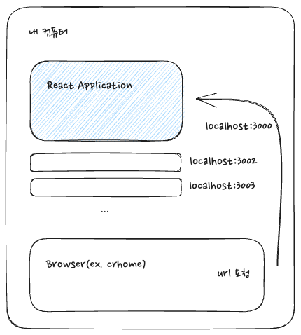

## react-app 이라 불리는 이유는?

react 는 라이브러리라이다. 다른 여타 라이브러리와 마찬가지로 pakage 의 일종이며, react 자체만으로는 application 이라고 불리오는게 좀 이상하다. 하지만 실제 우리는 react-app 이라는 표현을 쉽게 사용하고 있다. 왜 application 일까  

하나의 이유로는 실제 react 를 통하여 개발된 웹 사이트의 상호 인터렉션 과정이 마치 모바일 어플리케이션과 유사하다는 점에서 application 으로 불리기도 한다는 점이다. 실제 에어비엔비 사이트나 메타 등등 브라우저로 접근하였을 때 그 반응이 모바일 앱과 비슷한 경험을 제공한다는 것을 사용해보면 자연스럽게 알 수 있다.  

또 하나의 이유로는 react 기반 pakage set 에서(creat-react-app or create vite) 자체 웹 서버를 제공한다는 점에서 어플리케이션으로 불리울 수 있다.

## 웹 서버

react 자체만으로는 사실 웹 프로젝트를 진행하기에 부족한 부분이 많이 있다. 프레임워크가 아니기에 (그렇기에 더 자유롭지만) 온전하게 웹 사이트를 제작하기 위해서는 다른 라이브러리들을 의존해야 한다. 간단한 예시로서 react-route 가 있는데, 웹 사이트의 기본인 페이지전환 효과를 리엑트는 가상이지만 제공할 수 있는데 이 기능 자체는 react 라이브러리에는 존재하지 않는다.  

웹 서버 역시 react 에서는 제공하지 않는데, 공식문서에서 권장하는 패키지 설정버전으로 react 프로젝트를 실행하는것이 좋다.  

 

vite 로 통합된 react application 을 생성하면 자체 웹서버를 가지게 된다. 개발 환경에서 활용할 수 있도록 해주는데, 여기서 localhost 는 말 그대로 자신의 컴퓨터를 의미한다. 그렇기에 어떠한 절대적인 주소가 아니라 개개인마다 가지고 있는 컴퓨터의 주소라고 할 수 있고 그렇기에 자신을 제외하고는 위 주소로 접근할 수는 없다.  

브라우저에서 localhost:3000 으로 서버에게 요청을 보내게 되면, 내 컴퓨터 내의 react-application 은 요청에 맞는 페이지 응답을 브라우저에 전달하고, 브라우저는 이를 렌더링 하여 보여주게 된다.  

react apllication 역시 하나의 프로세스로서 포트 번호를 가지게 된다. 결국 하나의 application 으로 불리울만 하다.
