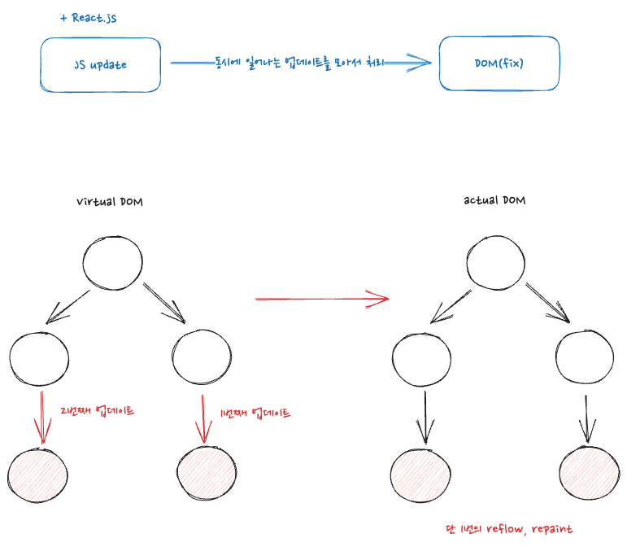

## react 의 virtual DOM

가상화된 DOM 에 대해 살펴보기 전에 먼저 DOM 이란 무엇이고 실제 브라우저의 렌더링 과정을 간략하게 살펴볼 필요가 있다.<br />

## Ciritical Render Path

여러 브라우저마다 차이는 존재하겠지만, 가장 기초적이며 렌더링의 필수적인 로직은 다음과 같다. <br />


<br />

server 로 부터 전달받은 html 문서를 브라우저는 더 쉽게 해석하기 위해 트리구조의 객체 모델을 생성하고 이를 DOM(Document Object Model) 이라고 한다. 노드 하나하나 객체이기에 자바스크립트에서 이 요소에 접근을 할 수 있게 된다. <br />
CSS 역시 CSSOM 을 형성하고(이는 DOM 과 유사하다), 생성된 두 객체 트리를 하나의 Render Tree 로 통합하게 된다. 즉 각 노드는 자신의 위치정보와 스타일 정보를 가지고 있게 된다. <br />
다음 실제 뷰포트내에서 각 렌더트리의 요소들이 어디에 위치하게 되는지, 레이어는 얼마나 형성할 것인지를 결정하는 Layout 단계를 거치게 된다. <br />
그 다음 실제 노드의 스타일을 적용하는 Paint 과정을 거친 후 실제 브라우저에서 렌더링이 마무리되게 된다. (굉장히 간략화 하여 설명함) <br />

## Javascript 를 통한 업데이트

유저가 어떠한 사이트에서 버튼을 클릭하여 이벤트를 발생시킨다고 가정한다. 이벤트가 호출이 되고 바인딩 되어있는 함수가 실행되어 실제 DOM 을 업데이트 하는것이 일반적이다. 이러한 과정은 다음과 같다. <br />


<br />

자바스크립트를 통한 DOM 의 업데이트 이후, 당연하게도 업데이트된 사항을 렌더링해야하기에 렌더트리 이후 과정을 반복하게 된다. <br />

문제는 layout 과 paint 과정은 브라우저입장에서 꽤나 무거운 작업이다. 만일 이러한 reflow, repaint 과정이 반복적으로 과도하게 발생한다면 당연하게도 사이트의 성능에 있어서 문제가 발생하게 된다. <br />

그렇기에 개발자는 어떻게 해서든 reflow, repaint 과정을 최소화 할 수 있도록 코드를 작성하여야 한다. 하나의 자바스크립트 예시를 통해 살펴보자. <br />

```html
<!-- 잘못된 코드 -->
<script>
  function onClick() {
    const $ul = document.getElementById("ul");
    // 무려 3000번 이상의 reflow, repaint 가 발생하게 된다.
    // 함수가 종료될 때 까지 4,500ms 를 소요
    for (let i = 0; i < 3000; i++) {
      $ul.innerHTML += `<li>${i}</ll>`;
    }
  }
</script>
<body>
  <button onClick="onClick()">리스트 추가하기</button>
  <ul id="ul"></ul>
</body>
```

<br />

반복문을 통해 li 요소를 생성하는데, 무려 3000번의 reflow, repaint 를 반복하게 된다. 엄청난 손해이다. <br />

```html
<script>
  function onClick() {
    const $ul = document.getElementById("ul");
    let list = "";

    for (let i = 0; i < 3000; i++) {
      list += `<li>${i}</ll>`;
    }
    // 앞에서 3000번의 반복을 통해 리스트를 생성하여 list 에 저장
    // 이후 딱 한번 reflow 를 발동시킨다.
    $ul.innerHTML = list;
  }
</script>
<body>
  <button onClick="onClick()">리스트 추가하기</button>
  <ul id="ul"></ul>
</body>
```

<br />

맨 처음 코드와 대비되는 점은 실제 브라우저가 단 한번 reflow, repaint 를 실행한다는 점이다. 코드 몇줄의 변화로 훨씬 효율적으로 렌더링을 한다고 할 수 있다.

## Virtual DOM

리엑트의 가상 DOM 은 이러한 reflow, repaint 의 최소화를 효율적으로 도와주게 된다. 즉, 개발자는 거대한 실수를 저지르지 않는한(react 의 규칙에 맞게) 가장 효율적으로 DOM 을 업데이트하게 된다. <br />



<br />

리엑트는 실제 DOM 이 아닌 가상의 객체 트리를 생성하여 이 객체 트리를 먼저 업데이트 해본다. 이 과정에서 실제 업데이트가 이루어져야 하는지, 어떠한 요소는 딱히 업데이트가 될 필요가 없는지, 어느 객체 트리 요소부터 업데이트가 진행되어야 하는지를 계산하게 된다.<br />

이러한 계산을 통해 실제 DOM 을 효율적으로 업데이트 하여 여러번 reflow, repaint 가 발생할 수 있는 상황을 예방해준다.
