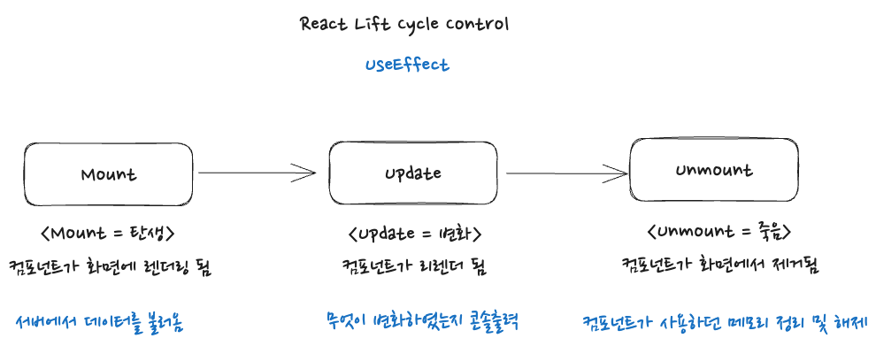

## 리엑트의 라이프 사이클

한없이 딥해질수 있는 내용이지만 간략하게 회고느낌으로 정리를 해보고자 한다.  

라이프 사이클이라고 하면 흔히 사람의 탄생과 죽음까지의 흐름을 일반적으로 의미한다. 마찬가지로 리엑트의 컴포넌트에도 이러한 사이클을 관리할 수 있는데, 이를 리엑트 라이프 사이클 이라고 한다.  

인간이 태어나 죽기까지 정말 여러가지 일을 하게 되는것처럼, 실제 사이트 내에서 하나의 컴포넌트가 사라지기 전까지 수 많은 작업이 필요할 수 있다. 컴포넌트가 렌더링이 되고 계속 업데이트 되다가 언마운트 되는 이러한 흐름 속에서 단순하게 상태값의 변화만 화면에 렌더해야할 때도 존재하지만, 보통 복잡한 사이트내에서는 이러한 흐름들 사이에 소위 부수 효과(side effect) 로서 컴포넌트가 렌더링 되자마자 한번 서버에서 데이터를 가져온다던지, 어떠한 상태값이 업데이트 되면 이러한 상태값의 조건에 따른 함수 실행, 언마운트 시 등록되어있던 이벤트리스너의 제거 등 필요한 작업을 진행해야할 때가 있다.  

이전 클래스 컴포넌트 시절에는 componentDidMount, componentDidUpdate, componentWillUnmount 메서드를 통해 관리하였고, 하나의 메서드에 여러 작업을 처리하는 방식이었다 (예를 들자면 초기 Mount 될 시 데이터 패칭, 스크린 state 조정 등 여러 작업을 componentDidMount 메서드에서 한번에 처리)  

함수 컴포넌트에서는 예전에는 이러한 라이프 사이클을 관리할 수 없었는데, useEffect 의 등장으로 이제 라이프사이클를 조정할 수 있게 되었다. 자칫 잘못사용하면 성능에 문제를 일으킬 수 있는 useEffect 이지만 여전히 리엑트 내 핵심적인 기능임에는 분명하기에 잘 사용해야한다.  

